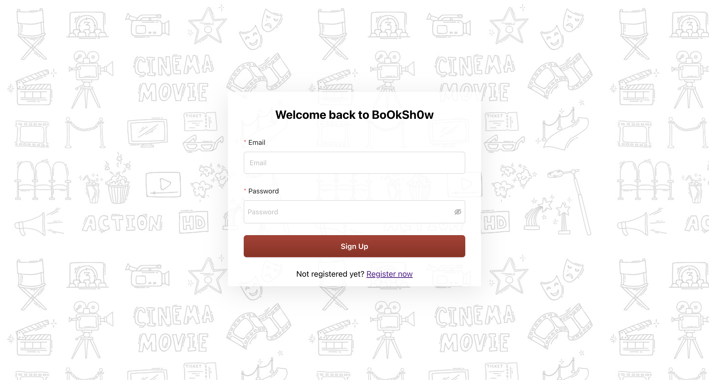
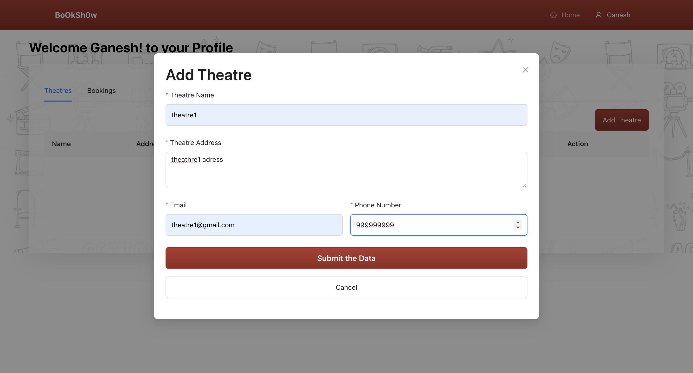
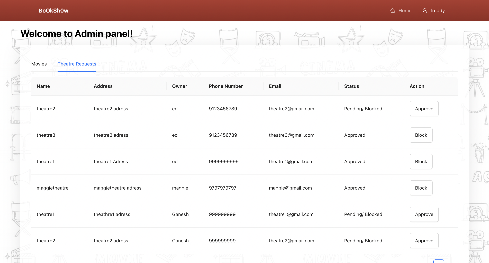
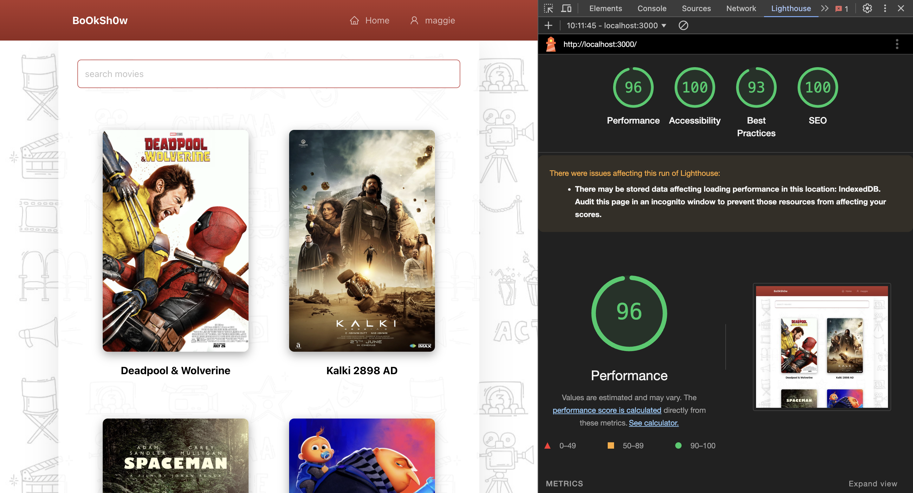

ShowBooking

**ShowBooking** is a comprehensive movie booking platform designed to provide users with a seamless experience for searching, browsing, and booking movie tickets. The application also allows admins to manage theatres, shows, and movies efficiently.

## Features

- **Movie Booking:**
  Designed and developed a platform allowing users to search for movies, select theatres, view showtimes, choose seats, and complete bookings.

  
   

- **Payment Integration:**
 Integrated the Stripe payment gateway for secure and seamless payment processing.
  

- **Authentication & Authorization:**
   Established authentication and authorization protocols using JWT tokens for various user and admin routes, enhancing system security.
  

- **CRUD Operations:**
  Enabled both users and admins to perform CRUD operations on theatres, shows, and movies while managing five MongoDB collections.
  
 

- **Performance:**
Achieved a 96% performance score by optimizing Web Vitals, significantly enhancing user experience and platform efficiency

## Technologies Used

- **Frontend:**
  - React.js
  - Redux/Redux Toolkit
  - Ant Design (AntD)
  - Tailwind CSS (if used)

- **Backend:**
  - Node.js
  - Express.js
  - MongoDB

- **Payment Integration:**
  - Stripe API

- **Authentication:**
  - JWT (JSON Web Tokens)

deployement link (please refresh once after loading error) : https://showbooking.onrender.com/login